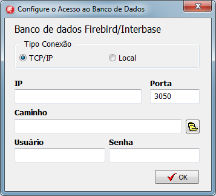
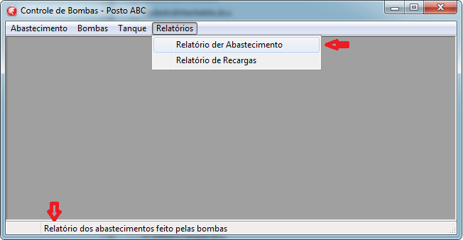
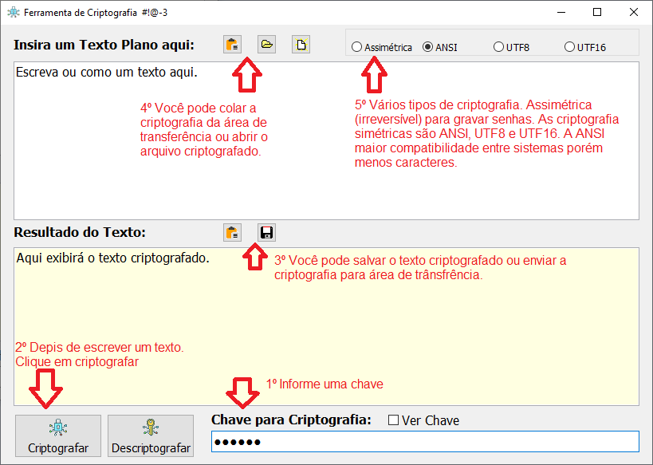

# 🔧 Projeto Demonstrativo: Controle de Bombas de Combustível (Delphi + Firebird)

## 💡 Sobre o Projeto

Este é um sistema demonstrativo de cadastro e controle de bombas de combustível, criado com foco em **boas práticas de programação em Delphi**, utilizando banco de dados Firebird e relatórios com Fortes Report. O objetivo é servir como um projeto de **portfólio técnico**, demonstrando domínio em:

- Orientação a Objetos
- Acesso a banco de dados
- Componentes visuais (VCL)
- Tratamento de erros global
- Boas práticas de UX voltadas à VCL Delphi
- Padrão de desenvolvimento com formulários herdados (inherited)

---

## 🛠 Tecnologias Utilizadas

- **Delphi XE8**
- **Firebird SQL**
- **Fortes Report** [download](https://github.com/fortesinformatica/fortesreport-ce/tree/master)
- VCL (Visual Component Library)

## 🚀 Diferenciais Técnicos

- **Criptografia**
- **Middleware**
- **Usabilidade**

### 🔐 Criptografia de Dados de Conexão

- Ao iniciar, caso o arquivo `database.dat` não exista no diretório do executável, o sistema exibe uma **tela de configuração da conexão com o banco**.
- Esses dados são **salvos em arquivo binário criptografado** com rotina própria de criptografia **desenvolvida integralmente por mim**.
- Acompanha um **aplicativo auxiliar** para testar e validar essa rotina.

### 🧩 Middleware em Delphi: Tratamento Global de Erros e Ajuda Contextual

Apesar do Delphi utilizar uma terminologia clássica, conceitos modernos como *middleware* foram aplicados:

- **Middleware de erros**: Toda exceção não tratada diretamente na aplicação é interceptada por um **handler global**, exibindo mensagens amigáveis ao usuário e registrando detalhes técnicos em `errolog.txt`.
- **Middleware visual de dicas (hints)**: Os hints dos itens do menu principal são capturados e exibidos automaticamente na barra de status, oferecendo ajuda contextual em tempo real.

### 🖼️ Usabilidade e Detalhes Visuais

- Uso de **Formulários herdados (Inheritable Forms)** para padronizar telas.
- Itens do menu exibem ajuda na **barra de status** ao serem selecionados.

---

## 📦 O que está incluído

- Código-fonte completo da aplicação
- Executável já compilado
- Scripts SQL e backup do banco
- Aplicativo auxiliar de criptografia (para testar e validar a rotina usada na aplicação)

---

## 🧠 Conceitos Aplicados

### ✅ Orientação a Objetos
- Classes bem definidas como `TBombas`, `TRecarga`, `TAbastecimento`, `TTanques` entre outras.
- Métodos organizados: `Cadastrar`, `Atualizar`, `Excluir`, `Localizar`, `IntegridadeReferencial`, etc.
- Uso de `Record` para separar campos persistentes (`Campos`) de atributos auxiliares (`Atributos`).
- Implementação de regras de negócio encapsuladas nas classes.

---

## 📂 Organização de Código

- Separação por camadas: dados, regras de negócio e interface.
- Técnicas "Fail Fast", Separação de responsábilidades, Clean Code.
- Uso de consultas dinâmicas e queries fixas para operações diretas.
- Implementação de **camada de validação** (ex: verificação de apelidos duplicados, integridade referencial antes de exclusão, limite de bombas por tanque).

---

## 🧪 Aplicativo Auxiliar

Além do sistema principal, o repositório inclui um **utilitário de criptografia** para testar a eficiência da rotina usada no armazenamento dos dados de conexão.

---

## 📫 Contato

Caso tenha dúvidas, sugestões ou queira discutir sobre o projeto:

**- ✉️ E-mail: [souza.sysnet@gmail.com](souza.sysnet@gmail.com)**

---

## 🗒️ Observações Finais

Este projeto tem caráter demonstrativo, mas foi desenvolvido com atenção a detalhes que facilitam manutenção, clareza e extensibilidade. O objetivo é mostrar que mesmo com tecnologias como Delphi e Firebird, é possível aplicar **boas práticas modernas** de desenvolvimento.

---
