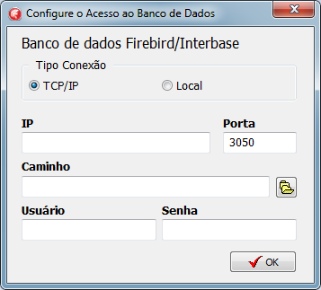
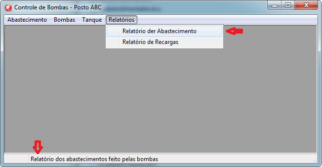

<h1>Projeto de Controle de Bombas de Combustível</h1>

<h3>Projeto</h3>

- Teste mostrando orientação a objeto, relatórios utilizando Fortes Report
- Utilizandoi Delphi XE 8, com Firebird
- Acompanhando código fonte, executável compilado, backup e scripts SQL 

<h3>Orientação a Objeto </h3>

- Médotos como Cadastrar, Atualizar, Localizar, Excluir, etc
- Funções overload

<h3>Particularidades</h3>

- Ao iniciar se no mesmo diretório onde se encontra o .exe não exisitir o arquivo "data.dat", irá abrir uma janela de configuração de acesso ao banco de dados

- Utilizando "Inheritable Forms"

- Quando um item é selecionado no menu, aparece uma explicação mais detalhada sobre o menu na barra de status

- Qualquer erro não tratado diretamente, está sendo tratado dentro do Eventos de Erro da aplicação, reportando o erro e gravando um log em "errolog.txt". No mesmo diretório do .exe

